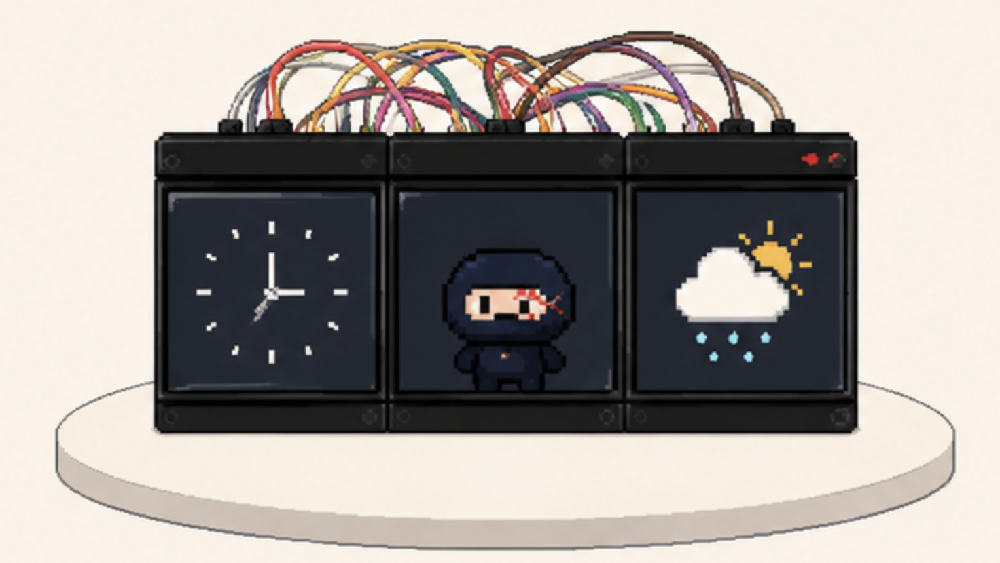
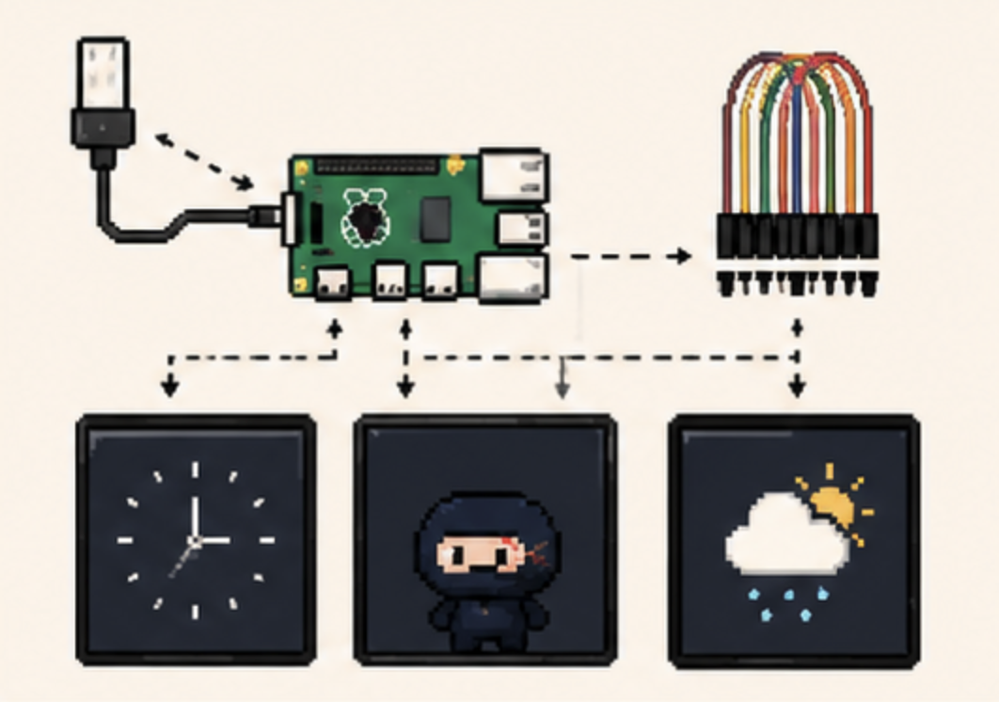
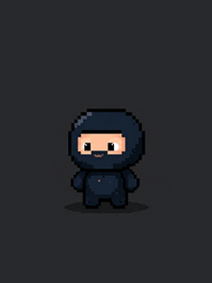
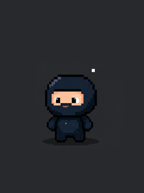

# Ninja Command Center

A grumpy ninja desk companion with voice interaction, animated pixel art face, and a triptych of tiny displays. Built on a Raspberry Pi 4.

Say **"Hey Ninja"** — the ninja wakes up, listens, thinks, and responds with a laconic Japanese-accented personality. He can manage your tasks, switch screens, and deliver dark haiku on demand.



## How It Works



Three 2.8" ILI9341 TFT displays sit side-by-side in a 3D-printed enclosure, each on its own SPI bus. The middle screen shows an animated pixel art ninja. The left and right screens run swappable HTML/CSS/JS modules — clock, Spotify, tasks, habits, GIFs, or anything you build in the web editor.

## The Ninja

<p align="center">
  
  
  
</p>

The ninja has multiple animated states — idle, talking, focused, angry, happy, confused, sleeping, and more. He reacts to wake words, voice conversations, task completions, and idle time. After 8 minutes of silence he gets sleepy. After 10, he falls asleep.

## Voice Commands

The ninja understands natural language and can execute actions:

| You say | Ninja does |
|---------|-----------|
| *"Add a task: buy milk"* | Creates a todo item |
| *"What are my tasks?"* | Lists today's tasks |
| *"Switch right screen to habits"* | Changes the display |
| *"Check off the painting habit"* | Marks a habit as done |
| *"What's 2 plus 2?"* | Answers (grumpily) |

Powered by Claude with tool use — the ninja calls your APIs and responds naturally.

## Screen Modules

Each side screen runs an HTML/CSS/JS module rendered by headless Chromium. Create your own in the built-in web editor.

**Built-in modules:**
- **Clock** — pixel font time + secondary timezone (LanaPixel font)
- **Spotify** — now playing with track, artist, progress bar, pixel art icons
- **Todo** — task list with checkboxes, pulls from web UI
- **Habits** — daily habit tracker with checked/unchecked state
- **GIF** — random pixel art cat GIFs from Tenor (native frame animation)
- **Ninja Says** — live subtitles when the ninja speaks (system module)

**Template variables** work directly in HTML:
```html
<div>Time zone: {{local_tz}}</div>
<div>In {{remote_label}} it's...</div>
```

**JavaScript data** available in modules:
```javascript
// Pre-loaded data
window.NINJA_DATA.tasks    // today's tasks
window.NINJA_DATA.habits   // today's habits

// Live API calls
const np = await fetch('/api/spotify/now-playing').then(r => r.json());
const tasks = await fetch('/api/tasks').then(r => r.json());
```

## Nudge System

The ninja periodically interrupts you with reminders and dark haiku:

- *"Water. Now."*
- *"Your back is not your enemy."*
- *"Deadline approaches. Like death, but less forgiving. Push to main and pray."*
- *"Notifications off. Peace at last, you tell yourself. You check anyway."*

40 original dark haiku, plus hydration, posture, movement, and break reminders. Scheduled nudge at 15:45: *"It's time to leave soon, no?"*

## Web App

The companion web app runs at `http://command-center.local:8888`:

- **Tasks** — priorities, recurring, drag-to-reorder
- **Habits** — 7-day grid, streaks, daily check-off
- **Focus** — Pomodoro timer linked to tasks
- **Insights** — weekly stats, streaks, focus time
- **Chat** — text conversation with the ninja
- **Screens** — module library, screen assignment, code editor
- **Settings** — volume, personality prompt, TTS voice, API keys

The **module editor** opens in a separate window with HTML/CSS/JS split view, live 240×320 preview, and one-click push to any display.

---

## Build Guide

### Parts List

| Part | Purpose | ~Cost |
|------|---------|-------|
| Raspberry Pi 4 (4GB) | Brain | $55 |
| WM8960 Audio HAT | Mic + speaker I/O | $15 |
| 3× 2.8" ILI9341 SPI TFT (240×320) | Displays | $8 each |
| Jumper wires (female-female) | Wiring | $3 |
| 3D-printed enclosure | Housing | — |
| USB-C power supply (5V 3A) | Power | $10 |

**Total: ~$100**

### Step 1: Flash SD Card

Use [Raspberry Pi Imager](https://www.raspberrypi.com/software/) to flash **Raspberry Pi OS (64-bit, Lite)**.

In settings:
- Hostname: `command-center`
- Enable SSH
- Set username: `command-center`
- Configure WiFi

### Step 2: Mount Audio HAT

Place the WM8960 Audio HAT on the Pi's GPIO header. This provides I2S audio (mic input + speaker output).

### Step 3: Wire Displays

Each display gets its own SPI bus — **no shared data lines**. This is critical for signal integrity.

```
DISPLAY WIRING — 3 SEPARATE SPI BUSES
══════════════════════════════════════

Display pin │ Left (SPI4)      │ Middle (SPI0)    │ Right (SPI5)
────────────┼──────────────────┼──────────────────┼──────────────────
VCC         │ Pin 1  (3.3V)    │ Pin 1  (3.3V)    │ Pin 1  (3.3V)
GND         │ Pin 6  (GND)     │ Pin 9  (GND)     │ Pin 14 (GND)
CS          │ Pin 7  (GPIO4)   │ Pin 24 (GPIO8)   │ Pin 32 (GPIO12)
RST         │ Pin 22 (GPIO25)  │ Pin 22 (GPIO25)  │ Pin 22 (GPIO25)
DC          │ Pin 18 (GPIO24)  │ Pin 16 (GPIO23)  │ Pin 15 (GPIO22)
MOSI (SDI)  │ Pin 31 (GPIO6)   │ Pin 19 (GPIO10)  │ Pin 8  (GPIO14)
SCK         │ Pin 26 (GPIO7)   │ Pin 23 (GPIO11)  │ Pin 10 (GPIO15)
LED         │ Pin 17 (3.3V)    │ Pin 17 (3.3V)    │ Pin 17 (3.3V)
MISO (SDO)  │ — not connected  │ — not connected  │ — not connected

RST is shared (Pin 22) — all 3 displays reset together.
VCC splits from Pin 1, LED splits from Pin 17.
```

**Do NOT connect MISO** — displays are write-only.

**Reserved by Audio HAT** (do not use): GPIO2, GPIO3, GPIO18, GPIO19, GPIO20, GPIO21.

### Step 4: Install Software

```bash
# SSH into the Pi
ssh command-center@command-center.local

# Clone
git clone https://github.com/PontusMadsen/ninja-command-center.git
cd ninja-command-center/pi

# Install
./scripts/install.sh
```

The install script handles:
- System packages (sox, alsa-utils)
- WM8960 audio driver
- Node.js dependencies
- Python dependencies (openwakeword, numpy, PIL)
- systemd service

### Step 5: Configure Boot

Edit `/boot/firmware/config.txt` — add at the end:

```ini
# Audio
dtparam=i2c_arm=on
dtparam=i2s=on
dtoverlay=i2s-mmap
dtoverlay=wm8960-soundcard

# SPI buses for displays
dtoverlay=spi0-1cs
dtoverlay=spi4-1cs
dtoverlay=spi5-1cs

# Middle display (DRM driver)
dtoverlay=mipi-dbi-spi,spi0-0,speed=32000000,width=240,height=320,reset-gpio=25,dc-gpio=23,write-only
```

Create the display firmware file:
```bash
cd /tmp
git clone https://github.com/notro/panel-mipi-dbi.git

cat > ili9341.txt << 'EOF'
command 0xCF 0x00 0xC1 0x30
command 0xED 0x64 0x03 0x12 0x81
command 0xE8 0x85 0x00 0x78
command 0xCB 0x39 0x2C 0x00 0x34 0x02
command 0xF7 0x20
command 0xEA 0x00 0x00
command 0xC0 0x23
command 0xC1 0x10
command 0xC5 0x3E 0x28
command 0xC7 0x86
command 0x36 0x88
command 0x3A 0x55
command 0xB1 0x00 0x18
command 0xB6 0x08 0x82 0x27
command 0xF2 0x00
command 0x26 0x01
command 0xE0 0x0F 0x31 0x2B 0x0C 0x0E 0x08 0x4E 0xF1 0x37 0x07 0x10 0x03 0x0E 0x09 0x00
command 0xE1 0x00 0x0E 0x14 0x03 0x11 0x07 0x31 0xC1 0x48 0x08 0x0F 0x0C 0x31 0x36 0x0F
command 0x11
delay 120
command 0x29
EOF

sudo python3 panel-mipi-dbi/mipi-dbi-cmd /lib/firmware/panel.bin ili9341.txt
```

Increase SPI buffer size — edit `/boot/firmware/cmdline.txt`, append:
```
spidev.bufsiz=256000
```

### Step 6: Install Playwright (for HTML modules)

```bash
cd ~/ninja-command-center/pi
npm install playwright
npx playwright install chromium
```

### Step 7: Configure Environment

```bash
cd ~/ninja-command-center/pi
cp .env.example .env
nano .env
```

**Required keys:**
| Key | Where to get it |
|-----|-----------------|
| `GROQ_API_KEY` | [console.groq.com](https://console.groq.com) — free tier |
| `ANTHROPIC_API_KEY` | [console.anthropic.com](https://console.anthropic.com) — pay-as-you-go |

**Optional keys:**
| Key | Purpose |
|-----|---------|
| `SPOTIFY_CLIENT_ID/SECRET` | Now playing + playback control ([developer.spotify.com](https://developer.spotify.com)) |
| Google TTS JSON key | Better voice (place `google-tts-key.json` in `pi/`) |
| `WEATHER_API_KEY` | Weather display ([openweathermap.org](https://openweathermap.org)) |
| `TENOR_API_KEY` | More GIF requests ([tenor.com](https://tenor.com/gifapi)) |

### Step 8: Set Up Google Cloud TTS (Optional)

For the ninja's Japanese-accented voice:

1. Go to [Google Cloud Console](https://console.cloud.google.com)
2. Create a project → Enable **Cloud Text-to-Speech API**
3. Create a **Service Account** → Download JSON key
4. Place the file as `pi/google-tts-key.json`

Without this, TTS falls back to Piper (local, English voice).

### Step 9: Reboot & Go

```bash
sudo reboot
```

After boot:
- Displays light up with clock + ninja + Spotify
- Open `http://command-center.local:8888` for the web UI
- Say **"Hey Ninja"** to start talking

### Step 10: Sudoers (for web UI restart)

```bash
sudo bash -c 'echo "command-center ALL=(ALL) NOPASSWD: ALL" > /etc/sudoers.d/ninja-hub'
```

---

## Project Structure

```
pi/
  src/
    orchestrator.js              # Main coordinator
    display-triptych.js          # Display driver (JS, command queue)
    display-triptych-render.py   # Display driver (Python, SPI + framebuffer)
    face-reactions.js            # Event → face expression mapping
    idle-behaviors.js            # Random idle animations
    llm/
      claude-stream.js           # Claude API with tool use
      tools.js                   # Voice command tools (add task, switch screen, etc.)
    screens/
      modules.js                 # Module registry + {{template}} rendering
      default-modules.js         # Built-in HTML modules
      html-renderer.js           # Playwright screenshot loop
      routes.js                  # Express routes for /screen/:id + API
      giphy.js                   # Tenor GIF fetcher
    nudges/
      index.js                   # Nudge scheduler
      nudge-bank.json            # Reminders + 40 dark haiku
    audio/                       # Record, playback, stock phrases
    wakeword/                    # OpenWakeWord "Hey Ninja" detection
    stt/groq.js                  # Groq Whisper speech-to-text
    tts/voicevox.js              # Google Cloud TTS (Japanese voice)
    integrations/                # Spotify, Calendar, Mail, Weather
    web/
      server.js                  # Express API + static files
      data.js                    # File-based persistence
      public/
        index.html               # Main web UI (SPA)
        editor.html              # Module editor (separate window)
        fonts/lanapixel.ttf      # LanaPixel pixel font
        icons/                   # Pixel art icons (SVG-derived PNGs)
  assets/
    fonts/lanapixel.ttf
    icons/                       # Source icon PNGs
  frames-pitft/                  # Face animation frames (JPEG sequences)
  data/                          # Runtime data (tasks, habits, modules) — gitignored
  systemd/ninja-hub.service      # systemd service definition
```

## Roadmap

### Done
- [x] 3× ILI9341 displays on separate SPI buses
- [x] Animated pixel art ninja face (middle screen)
- [x] Voice pipeline: wake word → STT → Claude → TTS
- [x] Voice-controlled tools (add task, switch screen, check habit)
- [x] HTML/CSS/JS module system with Chromium rendering
- [x] Web UI: tasks, habits, focus timer, insights, chat
- [x] Screen manager + module editor in web UI
- [x] Template variables (`{{local_tz}}` etc.)
- [x] Built-in modules: Clock, Spotify, Todo, Habits, GIF, Ninja Says
- [x] Nudge system: reminders + 40 dark haiku
- [x] Ninja subtitles during conversation
- [x] Display color calibration (brightness/saturation per screen)
- [x] LanaPixel pixel font throughout

### Next
- [ ] Custom pixel art ninja animations (replacing placeholder art)
- [ ] Touch input (XPT2046) — swipe between modules, tap to interact
- [ ] Crossscreen moments — all 3 displays as one 720×320 canvas
- [ ] Pomodoro timer module
- [ ] Weather module
- [ ] CalDAV calendar module
- [ ] Custom TTS voice (training ninja voice model)
- [ ] Web UI drag & drop for screen assignment
- [ ] Module sharing / marketplace

## Ninja Personality

The ninja speaks English with a thick Japanese accent — drops articles, uses short phrases, sprinkles in kana. Laconic, grumpy, secretly fond of the user.

> *"Fine. Added to your list. You better do it."*
>
> *"Ninja is bored. Are you actually working?"*
>
> *"Coffee getting cold. Just like your forgotten dreams. Drink it anyway."*


## Credits

- Ninja character & pixel art by [Pontus Madsen](https://littlegamers.com)
- Built with [Claude](https://anthropic.com), [Groq](https://groq.com), [Google Cloud TTS](https://cloud.google.com/text-to-speech), [OpenWakeWord](https://github.com/dscripka/openWakeWord)
- [LanaPixel](https://opengameart.org/content/lanapixel-localization-friendly-pixel-font) font by eishiya
- Triptych concept inspired by [@dokidek_](https://instagram.com/dokidek_)

## License

MIT
